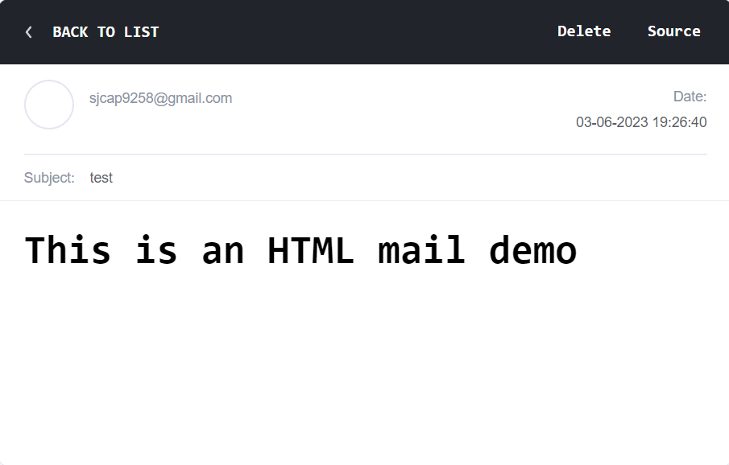
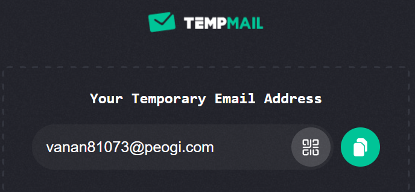
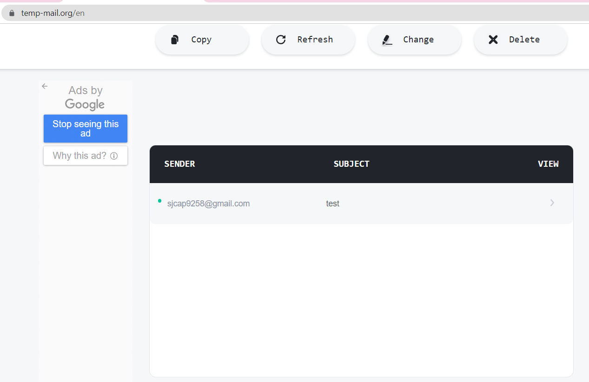
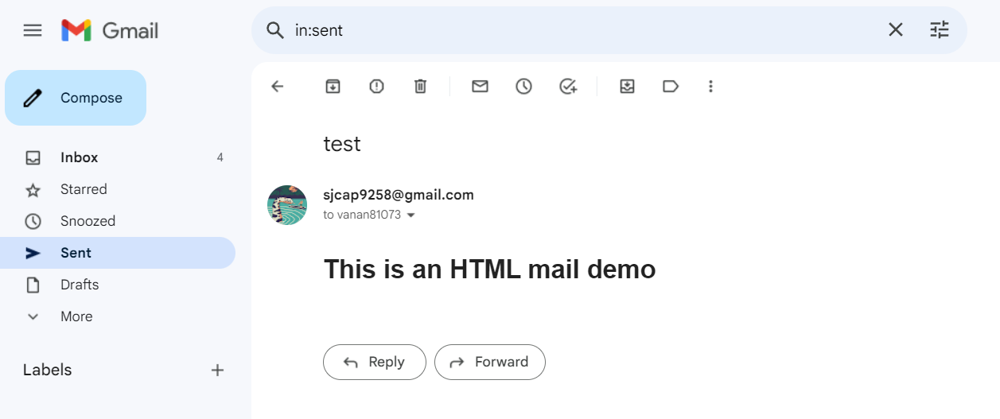

----# Nodemailer Project

This is a simple Node.js project showcasing how to send emails using the Nodemailer library. Nodemailer is a popular module for sending emails from a Node.js application, supporting various transport methods...

## Installation

To run this project, make sure you have Node.js installed on your machine. Then, follow these steps:

1. Clone the repository or download the source code.
2. Navigate to the project directory in your terminal.
3. Run `npm install` to install the project dependencies.

## User And Pass //

  user: 'your_email@gmail.com',   
  pass: 'your_password'

## Configuration

Before running the project, you need to provide your own email account credentials and adjust the email details. Follow these steps to configure the project:

1. Open the `server.js` file.
2. Locate the `config` object in the `mail` function.
3. Replace the `user` and `pass` properties with your own Gmail email address and password.
4. Modify the `from`, `to`, `subject`, `text`, and `html` properties to customize the email content.
5. Save the changes.

## Running the Project

To send an email using the configured settings, follow these steps:

1. Make sure you are in the project directory in your terminal.
2. Run `node server.js` to execute the code.
3. If everything is set up correctly, you should see a success message with the message ID in the console.

## Notes

- This project uses the Gmail SMTP server as an example. If you want to use a different email service, refer to the Nodemailer documentation to adjust the SMTP settings accordingly.
- Remember that using your actual email account credentials in the code can pose a security risk. Consider using environment variables or a configuration file to store sensitive information securely.

## Resources

- [Nodemailer Documentation](https://nodemailer.com/about/)
- [Node.js Documentation](https://nodejs.org/en/docs/)

Feel free to explore and modify the code to suit your needs. Happy emailing!
